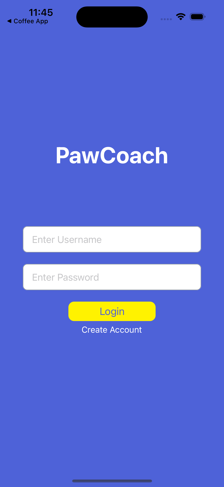

## PawCoach-Front-End

PawCoach is a app designed for dog owners, trainers, and vets to help owners find the best trainer/vet suited for their dog, and to help trainers and vets find their clients. The app serves to inform users of behavioral traits, breeds, as well as proper documentation to best match them with their ideal trainer or vet.

The app features, an articles section, dogs profile, matches view, as well as a feed where you can contact trainers/ vets and even set up appointments or payment

Submission for Cornell SP23 Animal Health Hackathon

## Before Running.. 
Before running, make sure to run:
-pod install
-pod update

To install the proper CocoaPods to run the app

## Screenshots

# Login and Onboarding
 

# Homepage, Article view
 

# Matches view, and Feed
 

